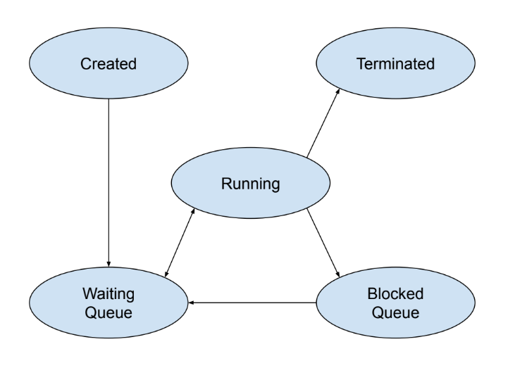
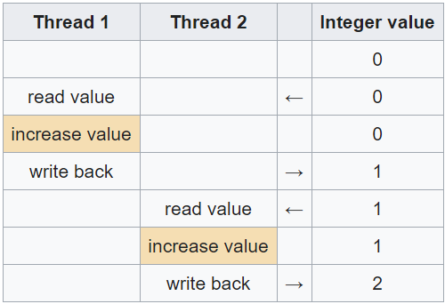
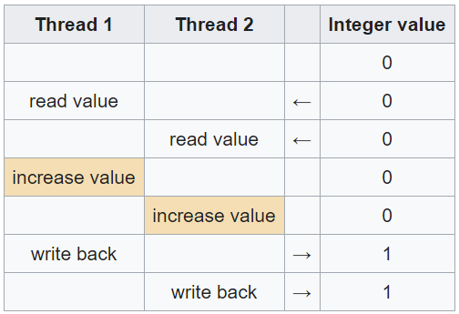

# 02 Prepare: Class Threads and Communication

**Things you should know or know how to do that you learned from last week**
(if not, then please ask---see [Matthew 7:7-8](https://www.churchofjesuschrist.org/study/scriptures/nt/matt/7?lang=eng))
1. You can create a thread using the threading module.
2. You can create a thread using inheritance.
3. Explain why the GIL prevents threads from running in parallel (in Python).
4. Answer if global variables are shared between threads.
5. Explain the difference between IO bound and CPU bound.
6. Explain what a critical section of code is.


<ins>Key Concepts in this week's reading:</ins>
1. States of a thread.
2. What is shared between threads?
3. How shared resources can cause problems (e.g., race conditions and deadlocks).
4. Synchronization tools (e.g., locks).
5. Thread safety.


## Overview

Last week, we learned to create threads that are considered "stand alone" or independent -- meaning that when that thread is running, it doesn't effect other threads. Also, there was no communication between threads.  This week, we are learning about the communication tools that allow threads to work together.

## States of a Thread

The operating system (Windows, Mac, Linux, etc.) is in control of managing threads.  The following diagram outlines the different states of a thread.



**Created**

When a thread is first started, it is in the created state.  This is where the operating system creates the thread's memory and resources for managing the thread.

**Waiting**

This state is where the thread is waiting to run on the computer's CPU.  There can be many threads in this state and they are in a queue.

**Running**

This is the state where the thread is running on a CPU.  There are three ways that a thread can be removed from this state:

1. The thread finishes.  It goes to the `terminated` state.
1. The thread makes an I/O (input / output) call.  Examples of I/O calls are reading/writing to a file, making an Internet request, printing to a terminal window, etc.  Because these I/O calls take time, that thread is placed on the blocked queue and has state of `blocked`.
1. Each thread is given only a short amount of time to run on the CPU.  This time is called a time slice.  If the time on the CPU is finished, the thread is placed back to the waiting queue to be run again (in turn) on the CPU.

**Blocked**

Here the thread is waiting for an I/O request to be completed.  When the operating system completes the I/O request, that thread is moved to the waiting queue.

**Terminated**

When the thread is finished, it moves to the terminated state.  Here the operating system can free any resources used by the thread.

### I/O bound and CPU Bound code

- CPU bound code will bounce between `running` and `waiting` states.
- I/O bound code will cycle between `running` -> `blocked` -> `waiting` states.

## What is shared between Threads?

You can easily share resources between threads. Any global variables are shared.  As programmers, we don't like global variables because of the side-effects that can happen with them.  The shared data doesn't have to be a global variable, if you pass the same list or dictionary to threads, then they are sharing that object.

Each thread has its own function stack.  This means that local variables that are created in a thread are unique to that thread.

We will learn about other data elements that are used for sharing data between threads and processes later in the course.

## Race Conditions and Deadlock

First, we need to understand issues with when threads share resources such as memory, or files.

### Race Condition

[Race Condition Wikipedia](https://en.wikipedia.org/wiki/Race_condition)

> A race condition arises in software when a computer program, to operate properly, depends on the sequence or timing of the program's processes or threads. Critical race conditions cause invalid execution and software bugs. Critical race conditions often happen when the processes or threads depend on some shared state. Operations upon shared states are done in critical sections that must be mutually exclusive. Failure to obey this rule can corrupt the shared state.

> A race condition can be difficult to reproduce and debug because the end result is nondeterministic and depends on the relative timing between interfering threads. Problems of this nature can therefore disappear when running in debug mode, adding extra logging, or attaching a debugger. Bugs that disappear like this during debugging attempts are often referred to as a "Heisenbug". It is therefore better to avoid race conditions by careful software design.

(The following is from the Wikipedia page on race conditions)

Assume that two threads each increment the value of a global integer variable by 1. Ideally, the following sequence of operations would take place: (Note that read and write below refers to reading the value from memory into the CPU and writing the value back to memory.  This is also true when using CPU registers)



In the case shown above, the final value is 2, as expected. However, if the two threads run simultaneously without locking or synchronization, the outcome of the operation could be wrong. The alternative sequence of operations below demonstrates this scenario:



In this case, the final value is 1 instead of the correct result of 2. This occurs because here the increment operations are not mutually exclusive. Each thread can be removed from the `running` state and placed in the `waiting` state at any time. Mutually exclusive operations are those that cannot be interrupted while accessing some resource such as a memory location.

### Deadlock

[Deadlock Wikipedia](https://en.wikipedia.org/wiki/Deadlock)

> In concurrent computing, a deadlock is a state in which each member of a group waits for another member, including itself, to take action, such as sending a message or more commonly releasing a lock. Deadlock is a common problem in multiprocessing systems, parallel computing, and distributed systems, where software and hardware locks are used to arbitrate shared resources and implement process synchronization.

> In an operating system, a deadlock occurs when a process or thread enters a waiting state because a requested system resource is held by another waiting process, which in turn is waiting for another resource held by another waiting process. If a process is unable to change its state indefinitely because the resources requested by it are being used by another waiting process, then the system is said to be in a deadlock.

For example:  Lets have two threads with two locks.  The thread `thread1` will acquire lock `a` then `b`.  Where, `thread2` will acquire lock `b` then `a`.  Both threads will wait forever when causing a deadlock as each thread locks a lock that the other needs.

```python
a = Lock()
b = Lock()

def thread1(data):
    a.acquire()
    b.acquire()

    # do something

    b.release()
    a.release()

def thread2(data):
    b.acquire()
    a.acquire()

    # do something

    a.release()
    b.release()
```

## Synchronization Tools

In order to control access to shared resources between threads, you can use `locks` and `semaphores` (we will cover semaphores next week).

### Lock

A lock can be used to protect a critical section (i.e., ensures that only 1 thread accesses a block of code at a time).  Below is the coding example of using a global lock:


```python
def thread_func(lock, filename, count):
    # acquire the lock before entering the critical section
    # If another thread has the lock, this thread will wait
    # until it's released.
    lock.acquire()
    
    # Do your stuff.  Only 1 thread is running this code
    f = open(filename, 'w')
    f.write(count)
    f.close()

    # release the lock.  If you fail to release the lock,
    # the next thread that tried to acquire the lock will
    # wait forever since the release will never happen.
    lock.release()

def main()
    lock = threading.Lock()
    thread_func(lock, "myfile.txt", 10)
```

**Rules when using locks**

1. Don't over do it.  The more locks you add to a program, the less parallel and concurrent it becomes.  If you do need to use locks in your code, just use the minimum required.  Remember that you don't lock threads, just shared data.
2. Try to keep the code in the critical section as small and fast as possible.  Since only one thread can enter a critical section at a time, all others are waiting.  If you have a critical section that takes a long time to execute, then your program will be slow.
3. Try to limit any I/O statements (i.e., file access, print() statements). The reason for this, it that the thread making the I/O request will be placed on the `blocked` queue.   **NEVER** put an `input()` statement in a critical section unless you have a really good reason (and I would like to hear it).


## Thread Safe

> Thread safety is a computer programming concept applicable to multi-threaded code. Thread-safe code only manipulates shared data structures in a manner that ensures that all threads behave properly and fulfill their design specifications without unintended interaction. There are various strategies for making thread-safe data structures.

> A program may execute code in several threads simultaneously in a shared address space where each of those threads has access to virtually all of the memory of every other thread. Thread safety is a property that allows code to run in multithreaded environments by re-establishing some of the correspondences between the actual flow of control and the text of the program, by means of synchronization.

Modern concurrent and parallel programming languages will list which functions and data structures are "thread safe".  This means that the function/data structure can be used in threads.  

For example: in the language C++, the `rand()` function is not thread safe.  If `rand()` is called in threads, the values returned by the `rand()` function will not be random.

Note that individual methods such as `append()` for list/set are thread safe in that if you call this method, you can be sure that the item was appended to the list/set.  However, in most cases, you are doing more to a list/set/dict than just one method call. You can still have a race condition "between" the method statements.

## Deamon Threads

Python also has deamon threads.  (Note, we are not using them in the course).  They are mentioned here in case you read about them in your research. 

> A Daemon Thread is a type of thread that can run independently in the background. These kinds of threads execute independently of the main thread. So these are called non-blocking threads.

The issue with deamon threads is that they are abruptly stopped at shutdown.  Their resources (memory, files, database transactions, etc.) may not be released properly.