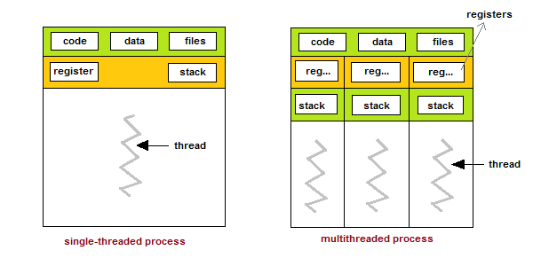

# 03 Prepare: Locks

**Things you should know or know how to do that you learned from last week**
(if not, then please ask---see [Matthew 7:7-8](https://www.churchofjesuschrist.org/study/scriptures/nt/matt/7?lang=eng))
1. Understand that threads have states and what some of the states are.
2. Basic understanding of what is shared between threads.
3. What kind of issues can happen if resources are shared between threads.
4. A basic understanding of what a lock is.


<ins>Key Concepts in this week's reading:</ins>
1. Further details into what is shared between threads.
2. Further details into what a lock is and how to use it.
3. Understanding of what a 'race condition' is.
4. How to use a list as a counter.

## Overview

This week's lesson is on thread synchronization and sharing of data between threads


## Review of what is shared between threads

The definition of a process is a program that has been loaded into memory.  All processes contain a main thread.  Once the main thread finishes, the process is also finished.  

On the left side of the figure below, this process has the main thread running.  This thread has full access to data, files, registers and stack - the whole program.

The right hand side of the figure shows three threads running in a process.  One of the threads is the main thread.  Note that they all share the common data and files of the process.  However, each thread has their own registers and stack.  This means that when a thread creates a local variable, that variable is not shared with another other threads.

Global variables are shared with each thread.  Although, we don't like to use global variables, they are sometimes used in multi-threaded and multi-processor programs.  They will be used sparingly in the course.



-- https://www.studytonight.com/operating-system/multithreading

The `threading` module in Python contains data structures to help with the sharing of data and synchronization.

## Review of Locks

Locks are used to protect a critical section in your program.  Critical sections can be accessing variables, data structures, file access, database access, etc.  If locks are used too often, then the program becomes linear in execution.  The best situation in designed threaded programs is to not use locks at all.  In the video processing assignment, each process was able to work without any synchronization between them.

[Threading locks Documentation](https://docs.python.org/3/library/threading.html#lock-objects)


### Example 1

Here is a small program that will create three threads where each one will update the first item in a list.  Then it will display the results.  In the code below, it displays the correct value of 30,000.  There are no locks used.

```python
import threading, time

THREADS = 3
ITEMS = 10000

def thread_function(data):
    for i in range(ITEMS):
        data[0] += 1

def main():    
    data = [0]
    start_time = time.perf_counter()

    # Create threads
    threads = [threading.Thread(target=thread_function, args=(data, )) for _ in range(THREADS)]

    for t in threads:
        t.start()

    for t in threads:
        t.join()

    print(f'All work completed: {data[0]:,} in {time.perf_counter() - start_time:.5f} seconds')

if __name__ == '__main__':
    main()
```

Output:

```
All work completed: 30,000 in 0.00295 seconds
```

### Example 2

Same program as above but looping 1,000,000 times.  The results should be 3,000,000, but it isn't.  In fact, each time the the program is run, different results are displayed.  This is caused by a race condition for the first element in the list.

```python
import threading, time

THREADS = 3
ITEMS = 1000000

def thread_function(data):
    for i in range(ITEMS):
        data[0] += 1

def main():    
    data = [0]
    start_time = time.perf_counter()

    # Create threads
    threads = [threading.Thread(target=thread_function, args=(data, )) for _ in range(THREADS)]

    for t in threads:
        t.start()

    for t in threads:
        t.join()

    print(f'All work completed: {data[0]:,} in {time.perf_counter() - start_time:.5f} seconds')

if __name__ == '__main__':
    main()
```

Output:

```
All work completed: 1,717,014 in 0.19610 seconds
```

### Example 3

We can fix the race condition by adding a lock around `data[0] += 1`.  We got the right answer with adding a lock, but the execution time of the program is now 5 seconds.

```python
import threading, time

THREADS = 3
ITEMS = 1000000

def thread_function(lock, data):
    for i in range(ITEMS):
        with lock:
            data[0] += 1

def main():    
    lock = threading.Lock()
    data = [0]
    start_time = time.perf_counter()

    # Create threads
    threads = [threading.Thread(target=thread_function, args=(lock, data)) for _ in range(THREADS)]

    for t in threads:
        t.start()

    for t in threads:
        t.join()

    print(f'All work completed: {data[0]:,} in {time.perf_counter() - start_time:.5f} seconds')

if __name__ == '__main__':
    main()    
```

Output:

```
All work completed: 3,000,000 in 5.09544 seconds
```


### Example 4

The best fix to this race condition example, is to remove the race condition.  In the three threads, they are all updating the same variable.  The fix is to have each thread have it's own variable to update.  These variables will be totaled after the threads are finished.

```python
import threading, time

THREADS = 3
ITEMS = 1000000

def thread_function(data, index):
    for i in range(ITEMS):
        data[index] += 1

def main():    
    data = [0] * THREADS   # Each thread uses it's own index into the list
    start_time = time.perf_counter()

    # Create threads
    threads = [threading.Thread(target=thread_function, args=(data, index)) for index in range(THREADS)]

    for t in threads:
        t.start()

    for t in threads:
        t.join()

    print(f'All work completed: {sum(data):,} in {time.perf_counter() - start_time:.5f} seconds')

if __name__ == '__main__':
    main()     
```

Output:

```
All work completed: 3,000,000 in 0.21455 seconds
```