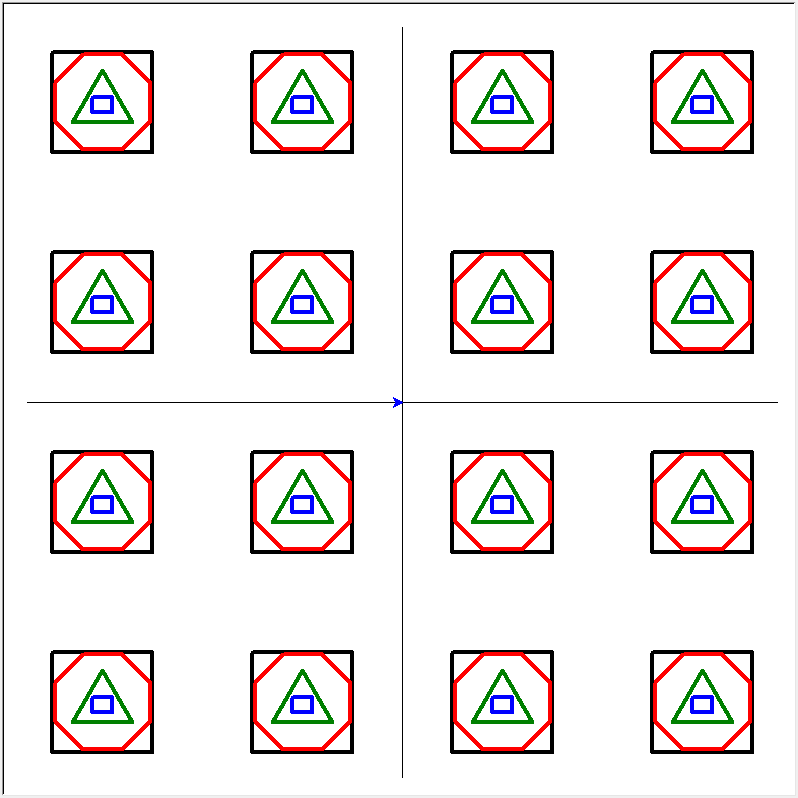

# 03 Team: Drawing Shapes 

# Overview

Your first assignment is to draw shapes on the screen. When you download the file `team03.py`, and run it.  It will create the following drawing on the screen.  Your task is to use threads for the drawing.

Image of the drawing shapes generated by the assignment.




## Instructions

1. Run `team03.py`.  It will draw the shapes in the image above.  These shapes are drawn without using threads.  Each type of shape is drawn one at a time - one after the other.  Here are the functions used for drawing.

	```python
	draw_squares(tur)
	draw_circles(tur)
	draw_triangles(tur)
	draw_rectangles(tur)
	```

2. Look for `TODO` comments in the program.  You will be creating and executing 4 threads.  Each thread will call one of the `draw_?(tur)` functions above.  (I.e. one thread calls `draw_squares()`, another calls `draw_circles()`, etc...).  Your goal is not to draw the shapes in the same order as the non-threaded function, but to end up with the same results.  The threads must be running concurrently and take turns drawing their shape.  For example, you should see some (not all) squares drawn, then circles, then rectangles, then squares again, then triangles, etc.  You can create extra functions if required.

3. Work with your team to think about how to modify the code to run with threads.

3. The assignment program will print out the following information.

```text
---------------------------------------------------------------
Start Drawing
All drawing commands have been created = 4.98925690
Number of Drawing Commands: 983
Total drawing time = 20.81664890
```

You want to modify it to run with threads, it should print out something like this (notice how fast the drawing commands are created):

```text
--------------------------------------------------------------
Start Drawing
All drawing commands have been created = 0.00000520
Number of Drawing Commands: 20
Total drawing time = 0.32776570
```

## Sample Solution

No solution provided. 