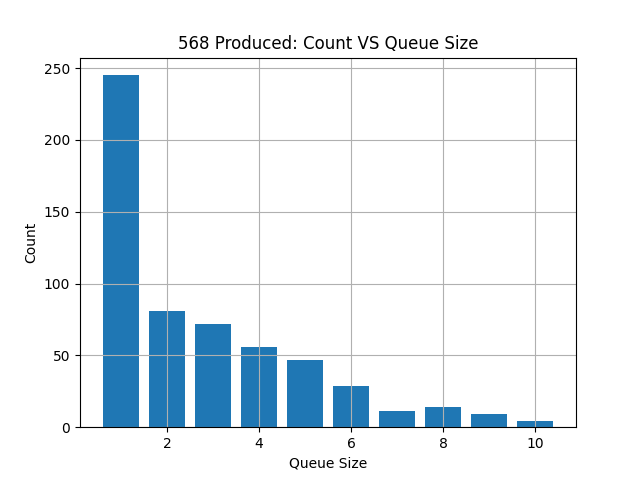

# 04 Prove: Factory and Dealership

## Overview

You will be using queue(s) and thread semaphore(s) to synchronize two threads in the production and selling of cars.

## Project Description

This assignment will contain two threaded classes.  A `Manufacturer` will create cars and a `Dealership` will retrieve them to be sold.  There is a limit on the number of cars that a dealership can handle at a time.  This is the `MAX_QUEUE_SIZE` variable.  Therefore, if the dealership is full of cars, the Factory must wait to produce cars until some cars are sold.

## Assignment

The Python file contains the following classes:

**Car**: This is the car that the factory will create.  When a car is created, it randomly selects a make, model and year.

**Manufacturer**: This threaded class creates the cars for the dealerships.  After a car is created, the manufacturer uses a short delay between creating another one.

**Dealer**: This is the dealership it retrieves cars created by the manufacturer to be sold. After a car is received, the dealership uses a short delay to sell the car.  The dealership only has room for 10 cars, therefore, if the dealership is full, the manufacturer must wait until a car is sold before creating another car.

**QueueTwoFiftyOne**: This is a queue that must be used in the assignment.

## Instructions

- Download the [assignment04.py](assignment04.py) file.
- Implement your code where the TODO comments are found.
- No global variables, all data must be passed to the objects.
- You are not allowed to use the normal Python Queue class.  You must use QueueTwoFiftyOne. This shared queue holds the Car objects and can not be greater than MAX_QUEUE_SIZE while your program is running.
- Your goal is to create `CARS_TO_PRODUCE` many cars. The Dealer thread must not know how many cars will be produced by the manufacturer.
- You will need two semaphores to properly implement this assignment.  Don't use a BoundedSemaphore. Do not use any arguments for the method acquire() when using semaphores.  Also, when using semaphores, do not use the **_value** attribute.

### Plot created by your program.  

**Before** the Dealership takes a car from the queue, it uses `size()` to get the size of the queue and updates the `queue_stats` list.  Here is an example of a plot (Your plot might/will look different).  Each bar represents the size of the queue while the program is running. 

## Rubric

Item | Proficient | Emerging | Beginning | Missing
--- | --- | --- | --- | ---
Runs without errors | 20 | 0 | 0 | 0
[Style](../../style.md) | 15 | 10 | 5 | 0
Semaphore used to control queue size | 15 | 10 | 5 | 0
Semaphore used to control reading empty queue | 15 | 10 | 5 | 0
Queue size not used in IF statement | 5 | 5 | 5 | 0
Plot of car count vs queue size | 15 | 10 | 5 | 0
Sentinel correctly sent from manufacturer to dealership | 15 | 10 | 5 | 0

Assignments are not accepted late. Instead, you should submit what you have completed by the due date for partial credit.

Assignments are individual and not team based.  Any assignments found to be plagiarized will be graded according to the `ACADEMIC HONESTY` section in the syllabus. The Assignment will be graded in broad categories as outlined in the syllabus:

## Submission

When finished, upload your Python file and Plot to Canvas.
