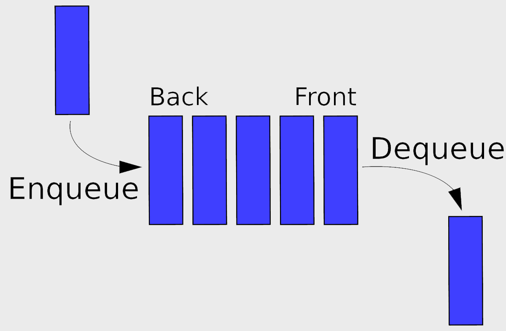

# 04 Prepare: Queues and Semaphores

**Things you should know or know how to do that you learned from last week**
(if not, then please ask---see [Matthew 7:7-8](https://www.churchofjesuschrist.org/study/scriptures/nt/matt/7?lang=eng))
1. Understand what a lock is and how to use it.
2. Understand what a race condition is and how to avoid it.
3. How to use a list as a counter.

<ins>Key Concepts in this week's reading:</ins>
1. What a queue is and how to use it.
2. What a sentinel is and how to use it.
3. What semaphores are and how to use them.

## Overview

This week's lesson is on thread synchronization and sharing of data between threads.


## Queue

One data structure that is used to share data between threads is called a queue.  It is a FIFO structure (First-In First-Out).  Items are added to the queue at one end. (This is the Python `put()` function).  Then items are removed from the other end. (Python uses the `get()` function)



- [Python Documentation](https://docs.python.org/3/library/queue.html)
- [Python documentation on threading queue](https://docs.python.org/3/library/queue.html)
- [Python Queue Video](https://www.youtube.com/watch?v=TQx3IfCVvQ0)

The Queue data structure is `thread safe` which means that the `get()` and `put()` when used will add or remove an item from the queue without race conditions.  These type of methods or operations are called atomic.

Here is an example of creating and using a queue.  Note that `queue` is not part of the threading module.

```python
import queue

q = queue.Queue()

q.put('House')
q.put('tree')
q.put('Farm')
q.put('Truck')

print(f'Size of queue = {q.qsize()}')
print(f'Get an item from the queue: {q.get()}')

print(f'Size of queue = {q.qsize()}')
print(f'Get an item from the queue: {q.get()}')
```

Output:

```
Size of queue = 4
Get an item from the queue: House
Size of queue = 3
Get an item from the queue: tree
```

**get() method**

If a thread uses `get()` on a queue where there are no items in it, that thread will be suspended (placed on the Blocked queue in the operating system) until there is something in the queue.  If an item is never added to the queue, this is a deadlock situation where the program hangs.

<ins>Note</ins>
Not all the queue functions are thread safe. For example, the "qsize()" function is not thread safe. This means that it should NOT be used to make logical conditions (IF statements). You cannot rely upon the size of the queue to make a decision. Once you read the size of the queue, it is possible (probable?) that the size will no longer be that value. Since multiple threads can add/remove from the queue, you should only use the thread safe functions (like get and put).


Example of using a queue in a thread:


```python
import threading, queue

def thread_function(q):
    item = q.get()
    print(f'Thread: {item}')

def main():
	q = queue.Queue()

	q.put('one')
	q.put('two')
	q.put('three')

	# Create 3 threads - This is a list comprehension
	# Pass the queue as an argument to the threads
	threads = [threading.Thread(target=thread_function, args=(q, )) for _ in range(3)]

	# start all threads
	for i in range(3):
		threads[i].start()

	# Wait for them to finish
	for i in range(3):
		threads[i].join()

	print('All work completed')

if __name__ == '__main__':
	main()
```

Output:

```
Thread: one
Thread: two
Thread: three
All work completed
```

### Queue deadlock situation

[Issue with not clearing a Queue](https://docs.python.org/3/library/multiprocessing.html#synchronization-between-processes)

> The following is from the above link

Bear in mind that a process that has put items in a queue will wait before terminating until all the buffered items are fed by the “feeder” thread to the underlying pipe. (The child process can call the `Queue.cancel_join_thread` method of the queue to avoid this behavior.)

This means that whenever you use a queue you need to make sure that all items which have been put on the queue will eventually be removed before the process is joined. Otherwise you cannot be sure that processes which have put items on the queue will terminate. Remember also that non-daemonic processes will be joined automatically.

An example which will deadlock is the following:

```python
from multiprocessing import Process, Queue

def f(q):
    q.put('X' * 1000000)

if __name__ == '__main__':
    queue = Queue()
    p = Process(target=f, args=(queue,))
    p.start()
    p.join()                    # this deadlocks
    obj = queue.get()

```

A fix here would be to swap the last two lines.


### Example

Here is an example of using a shared queue between two threads.  Note that the number of `put()` calls must match the number of `get()` calls.  If this is not the case, you might/will have deadlock.

```python
import threading
import queue

MAX_COUNT = 10

def read_thread(shared_q):
    for i in range(MAX_COUNT):
        # read from queue
        print(shared_q.get())

def write_thread(shared_q):
    for i in range(MAX_COUNT):
        # place value onto queue
        shared_q.put(i)

def main():
    """ Main function """

    shared_q = queue.Queue()

    write = threading.Thread(target=write_thread, args=(shared_q,))
    read = threading.Thread(target=read_thread, args=(shared_q,))

    read.start()        # doesn't matter which starts first
    write.start()

    write.join()		# Doesn't matter the order
    read.join()

if __name__ == '__main__':
    main()
```

Output:

```
0
1
2
3
4
5
6
7
8
9
```

## Sentinel

Sometimes in programs we need a way to communicate from one thread to another to terminate. Often we will have one thread looping in an endless WHILE loop. This thread is popping items off a queue (or blocked waiting for items to be placed on the queue). When the other thread(s) is done placing items on the queue, we need a way to signal/communicate to the first thread that no more items will ever be placed on the queue again. Since no more items will ever be placed on the queue, the thread should terminate.

We can define a special value, called a ["sentinel"](https://en.wikipedia.org/wiki/Sentinel_value) to send from one or more threads to another thread, to terminate. The sentinel should be a value that normally would never be sent under normal situation, else a thread would terminate prematurely. 

Normally, we want to avoid imbuing/endowing our data with extra meaning. For example, if a function takes integers, then the meaning of the integer should be limited to the value of the integer. If we define the number "-1" to mean something more than one less than zero, then we have imbued/endowed the value "-1" with more meaning. This creates a coupling between the calling function and the function. Now, a programmer must know ahead of time that some integers have more meaning than their values, and take additional care. If the function ever changes the extra meaning of "-1", then any calling functions would have to be refactored. This is an example of ["Content Coupling"](https://www.geeksforgeeks.org/software-engineering-coupling-and-cohesion/) and is the worst kind of coupling.

However, sometimes we cannot avoid using content coupling. In such a situation, we should select a value that provides the least risk of being sent inadvertently. In Python, we can use different data types to reduce this risk. 

### Example Using a Sentinel with a Queue
Using the previous example of a read thread and write thread, we will use a WHILE loop in the read thread. This thread will loop forever (blocking on the queue.get() function) waiting for the write thread to place numbers on the queue. Once the write thread is done, it will place a sentinel on the queue.

```python
import threading
import queue

MAX_COUNT = 10

def read_thread(shared_q):
    while True:
        # read from queue
        i = shared_q.get()
        if i == None:
            break
        print(i)

def write_thread(shared_q):
    for i in range(MAX_COUNT):
        # place value onto queue
        shared_q.put(i)

def main():
    """ Main function """

    shared_q = queue.Queue()

    write = threading.Thread(target=write_thread, args=(shared_q,))
    read = threading.Thread(target=read_thread, args=(shared_q,))

    read.start()        # doesn't matter which starts first
    write.start()

    write.join()		# Doesn't matter the order
    read.join()

if __name__ == '__main__':
    main()
```

We have used the special ["None" object](https://www.geeksforgeeks.org/python-none-keyword/) as our sentinel. Another common sentinel is to use a word such as "DONE".

## Semaphores

- [Thread Semaphore Document](https://docs.python.org/3/library/threading.html#semaphore-objects)
- [Wikipedia page](https://en.wikipedia.org/wiki/Semaphore_(programming))
- [Read the first two sections on locks and semaphores](https://hackernoon.com/synchronization-primitives-in-python-564f89fee732)

> In computer science, a semaphore is a variable or abstract data type used to control access to a common resource by multiple processes and avoid critical section problems in a concurrent system such as a multitasking operating system. A trivial semaphore is a plain variable that is changed (for example, incremented or decremented, or toggled) depending on programmer-defined conditions.

> **A useful way to think of a semaphore as used in a real-world system is as a record of how many units of a particular resource are available, coupled with operations to adjust that record safely (i.e., to avoid race conditions) as units are acquired or become free, and, if necessary, wait until a unit of the resource becomes available.**

> Semaphores are a useful tool in the prevention of race conditions; however, their use is by no means a guarantee that a program is free from these problems. Semaphores which allow an arbitrary resource count are called counting semaphores, while semaphores which are restricted to the values 0 and 1 (or locked/unlocked, unavailable/available) are called binary semaphores and are used to implement locks.

> The semaphore concept was invented by Dutch computer scientist Edsger Dijkstra in 1962 or 1963, when Dijkstra and his team were developing an operating system for the Electrologica X8. That system eventually became known as THE multiprogramming system.

Whereas a `Lock` is a "only allow one thread in at a time".  A `Semaphore` allows multiple threads to enter an area of code.

When a semaphore is created, you can indicate that number of concurrent threads that can be allowed "in".  They are used to control access to data not threads.  They are a synchronization construct whereas a lock is mutual exclusion control.

```python
sem = Semaphore(count)

sem.acquire()
# Do something
sem.release()
```

Each time `acquire()` is called, two outcomes are possible.  

1. If the semaphore count is zero, then that thread will be suspended.
2. If the count is >0, then the count is decreased by one and the thread gains access to the protected code.  
 
When a thread calls `release()` on the semaphore, the count is increased by one and the operating system will "wake up" any threads waiting on the semaphore.

Having a thread wait on a semaphore that is never `released()` is a deadlock situation. Semaphores are often used with locks.  A semaphore of size 1 is the same as a lock.

### Example
```python
from threading import Semaphore
import threading       
import time        

THREADS = 3

# creating instance
def display(semaphore: threading.Semaphore, name: str):
    # calling acquire method
    print(f'----- Thread-{name}: display function called -----\n', end="")
    print(f'Thread-{name} value before acquire = {semaphore._value}\n', end="")
    semaphore.acquire()                
    print(f'Thread-{name} value after acquire = {semaphore._value}\n', end="")

    # calling release method
    print('Calling release, another thread should unblock\n', end="")
    time.sleep(3)
    semaphore.release()    
    print(f'Thread-{name} value after release = {semaphore._value}\n', end="")

def increment(semaphore: threading.Semaphore):
    time.sleep(1)
    print('All threads are blocked. By calling release, one of the threads will unblock.\n', end="")
    time.sleep(3)
    semaphore.release()


def main():
    sem = threading.Semaphore(0)        

    # creating multiple thread 
    threads = [ threading.Thread(target=display, args=(sem, f'{x}')) for x in range(0, THREADS) ]
    threads.append(threading.Thread(target=increment, args=(sem,)))
  
    # calling the threads 
    for t in threads:
        t.start()

    for t in threads:
        t.join()

if __name__ == '__main__':
    main()
```

Output:
```
1  ----- Thread-0: display function called -----
2  Thread-0 value before acquire = 0
3  ----- Thread-1: display function called -----
4  ----- Thread-2: display function called -----
5  Thread-1 value before acquire = 0
6  Thread-2 value before acquire = 0
7  All threads are blocked. By calling release, one of the threads will unblock.
8  Thread-0 value after acquire = 0
9  Calling release, another thread should unblock
10 Thread-0 value after release = 1
11 Thread-1 value after acquire = 0
12 Calling release, another thread should unblock
13 Thread-1 value after release = 1
14 Thread-2 value after acquire = 0
15 Calling release, another thread should unblock
16 Thread-2 value after release = 1
```

Notice that threads 0, 1, and 2 all start up and block on the acquire function call (see line 7). This happens because the count of the semaphore is zero when acquire is called.

Then another thread is started and calls the increment function. This new thread calls release on the semaphore. The count (temporarily) increases to one, but one of the threads is able to acquire the semaphore and decreases the count back to zero---see line 8 (in the above run, this is Thread-0). 

Release is called (see line 10) and the count increases to one. Another thread is able to acquire the semaphore and unblocks (see line 11).  

This thread (in the above run, Thread-1) calls release and the count increases to one (see line 13). The final thread is able to acquire the semaphore and deceases the count back to zero (see line 14).

Finally, the last thread call release and the count increases to one (see line 16).

This block/unblock behavior is how we can synchronize which threads are allowed to enter a critical section of code.

Note: If we had created the semaphore with an initial starting count of one, so:
   sem = threading.Semaphore(1)

Then the one of the three threads could have acquired the semaphore (so not blocked) and then decreased the count. This is called a mutex and is useful if we want at least one thread to enter a critical section of code, but block any others. Or, if we are looping inside of thread, then the critical section of code can be executed once, and then blocked on the next loop waiting for another thread to call release.