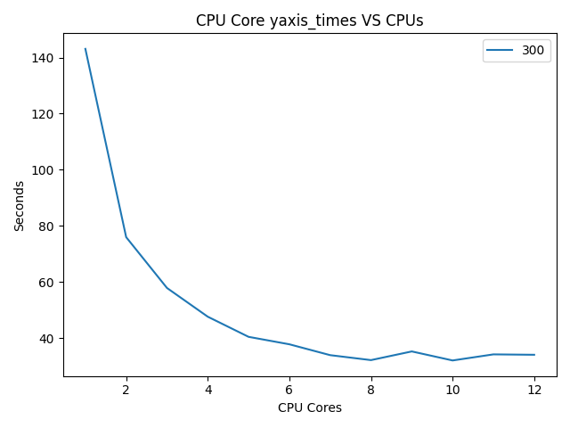

# 06 Prove: Video Frame Processing

## Overview

You will be finishing [Team06](../team/team06.md), if your team did not finish it. Then you will be modifying it to run using a range of processes and plotting the results.

Download the [assignment06.py](assignment06.py) file and read the requirements.

## Project Description

Your program will need to process all 300 frames using starting with 1 CPU core. You will need to keep track of the time it took to process all of the frames.  (See the main code for the variables that will be used.)

Then, you will process all of the frames using 2 CPU cores and record the time it took.  Then 3 CPU cores, 4 CPU cores, etc... until you reach `CPU_COUNT` CPU cores.

On my computer, I have 8 CPU cores.  The const variable `CPU_COUNT` is set to 4 more the number of CPU cores on your computer.  So for me CPU_COUNT equals 12.  Here is a example of the plot that is created for 12 CPU cores. While your results might look slightly different, the general relationship should hold.

## Assignment

1. Download the [assignment06.py](assignment06.py) file.
2. Review the requirements and answer the questions at the top.

## Rubric

Item | Proficient | Emerging | Beginning | Missing
--- | --- | --- | --- | ---
Runs without errors | 35 | 0 | 0 | 0
[Style](../../style.md) | 15 | 10 | 5 | 0
Plot produced | 20 | 0 | 0 | 0
Code will produce 300 frames that can be converted into a final video | 30 | 0 | 0 | 0

Assignments are not accepted late. Instead, you should submit what you have completed by the due date for partial credit.

Assignments are individual and not team based.  Any assignments found to be  plagiarized will be graded according to the `ACADEMIC HONESTY` section in the syllabus. The Assignment will be graded in broad categories as outlined in the syllabus:

## Submission

When finished, upload your Python file and plot to Canvas. Don't upload the video---but make sure to answer the questions at the top of the assignment.
