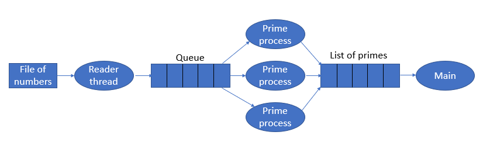

# 07 Team: Using Multiprocessing Semaphores, Queue, and List

## Overview

You will be creating a thread and many processes to check a list of prime numbers from a file.

## Assignment

The following graph outlines the processes and data structures that you will need to solve this program.

**data.txt** This is the file that contains a list of numbers to test if they are prime.

**Reader Thread** This is a thread that will read the data file and place items onto a Queue.  There is no limit on the size of the queue.

**Queue** This is a multiprocessing Queue.

**Prime Process** This is a process that will read something from the Queue and check to see if it is a prime number.  If the number is prime, it will place the number on a shared list.  You will create n number of processes, where n is equal to the number of cpus/cores on your computer.

**List of Primes** This is a shared List that will contain the prime numbers

**Main** This is the main code that will create the thread, processes, queue, semaphore(s), and list.  It will assert the amount of prime numbers after the `prime process`'s are finished.

>You might want to review 'Opening A File' in [prepare00](../../week00/prepare00.md)

### Requirements

1. Download the file `team07.py` from GitHub [File Link](team07.py)
2. Read the numbers from the data file into a queue.
3. Create `prime processes`'s based on the number of cpus on your computer.
4. Do not hard code the number of values that the program will process. Your program needs to handle any number of values in a data file.
5. Ensure that you find the correct number of primes (the assert should pass).
6. Talk with your team about the questions at the top of the code.

## Sample Solution

No solution provided.

