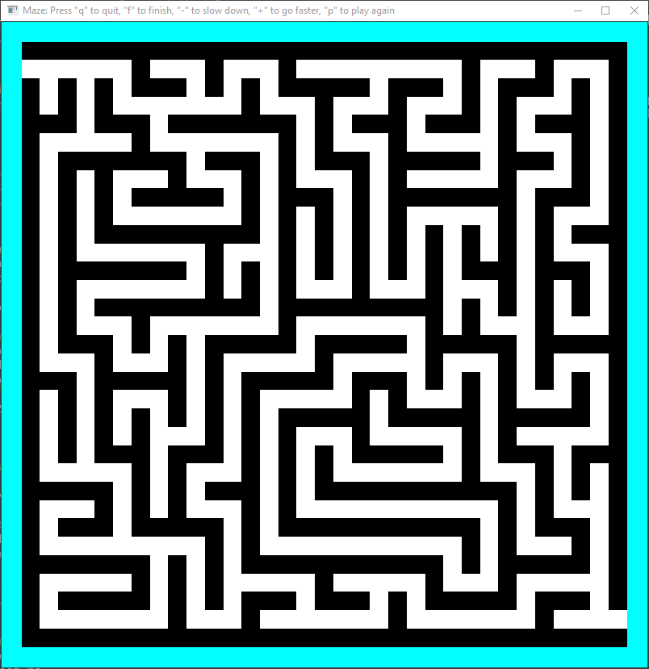

# 08 Prove: Finding Paths in a Maze

## Overview

You will be writing a program to find a path in a Maze.

## Project Description

You will be finding a path between the start and end positions in a maze.  In the image below, the starting position is in the top-left and the ending position the bottom-right.



There are two classes included in the assignment that you will be using.

**Maze**

This hold the maze of the program.  It is given a bitmap image of the maze.  You are able to get information about individual cells (ie., color of a cell, is it a wall, etc.).  Please refer to the `maze.py` file for the methods that can be used.

**Screen**

This class is used by the Maze to save drawing commands while the program is finding a path or looking for the ending position.  The reason for this class is that only the main thread can draw to the screen.  Therefore, this class will save all of the drawing commands until asked to display them in your program.  You should not need to look at this code for your assignment.

## Assignment

The assignment is broken into 2 sections.

### Part 1 - Find a Path

[Video Example of Finding a Path](find_path.mp4)

The file `assignment09-p1.py` contains the starting point for this part of the assignment.  There are functions that you are not allowed to change so make sure you note which ones they are.

The goal of this part of the assignment is to use recursion to find a path from the start to the exit.  In the above video, you can see that if you need to backtrack because a path is a dead end, you indicate the locations that you have been with the grey color. (Review the Maze class on the methods that you can call).

In this part of the assignment, the base case of the recursion is finding the end exit position.  (Review recursion from the links at the end of this page).

Here is a sample run (log file) of part 1.  For some of the mazes, your values will/might be different.

```
****************************************
Part 1

File: verysmall.bmp
Number of drawing commands for = 72
Found path has length          = 11

File: verysmall-loops.bmp
Number of drawing commands for = 292
Found path has length          = 55

File: small.bmp
Number of drawing commands for = 2416
Found path has length          = 79

File: small-loops.bmp
Number of drawing commands for = 1444
Found path has length          = 151

File: small-odd.bmp
Number of drawing commands for = 1836
Found path has length          = 79

File: small-open.bmp
Number of drawing commands for = 3184
Found path has length          = 405

File: large.bmp
Number of drawing commands for = 35856
Found path has length          = 1299

File: large-loops.bmp
Number of drawing commands for = 39180
Found path has length          = 1287
****************************************
```


### Part 2 - Find the End Position or Exit

[Video Example of Finding the End Position](find_end_position.mp4)

The file `assignment09-p2.py` contains the starting point for this part of the assignment.  There are functions that you are not allowed to change.  (Please note them) .

In part 2 of the assignment, you will be using threads to find the exit position.  You are not going to return a path from start to end.  

When a thread comes to a fork or division in the maze, it will create a thread for each path except for one.  The thread that found the fork in the path will take one of the paths. The other paths will be searched by the newly created threads.  When one of the threads finds the end position, that thread needs to stop all other threads.  Recursion is required for this part of the assignment.

In the example image below, the red thread starts the maze.  It moves along until it comes to a fork.  It created a thread (color blue) and that new thread continue down one of the paths.  The red thread continues down the other path.  Note that in some of the mazes, there can be 3 different paths at a fork.

In the sample below, there are a total of 7 threads created.

In this example, the orange colored thread found the exit position.  When that happens, it needs to tell the other threads to stop.

In order to receive full points for this part of the assignment, threads need to be moving through the maze concurrently.  Watch the video above to see an example.

In the header section of the Python file, are 2 questions that need to be answered.


Here is a example log file output.  Your values might/will be different for some mazes.

```
****************************************
Part 2

File: verysmall.bmp
Number of drawing commands = 84
Number of threads created  = 3

File: verysmall-loops.bmp
Number of drawing commands = 322
Number of threads created  = 7

File: small.bmp
Number of drawing commands = 1744
Number of threads created  = 20

File: small-loops.bmp
Number of drawing commands = 1990
Number of threads created  = 33

File: small-odd.bmp
Number of drawing commands = 2120
Number of threads created  = 141

File: small-open.bmp
Number of drawing commands = 2570
Number of threads created  = 215

File: large.bmp
Number of drawing commands = 31274
Number of threads created  = 366

File: large-loops.bmp
Number of drawing commands = 31862
Number of threads created  = 534
****************************************
```

## Links on Recursion:

- [Recursion (computer science)](https://en.wikipedia.org/wiki/Recursion_\(computer_science\))
- [Recursion in Python](https://realpython.com/python-thinking-recursively/#recursive-functions-in-python)
- [Understanding Recursion](https://stackabuse.com/understanding-recursive-functions-with-python/)
- [Video on Recursion](https://www.youtube.com/watch?v=ngCos392W4w)
- [What on Earth is Recursion? - Computerphile](https://www.youtube.com/watch?v=Mv9NEXX1VHc)


## Software module requirements

You must install the module `opencv-python`.  Use the same technique that you used to install `numpy` and `matplotlib`. 

```
pip install opencv-python
```

## Rubric

**Part 1**
Item | Proficient | Emerging | Beginning | Missing
--- | --- | --- | --- | ---
Runs without errors | 10 | 0 | 0 | 0
[Style](../../style.md) | 10 | 7 | 3 | 0
Recursion used to find solution path | 10 | 0 | 0 | 0
Incorrect paths recolored correctly | 10 | 7 | 3 | 0
Correctly finds end position | 5 | 0 | 0 | 0


**Part 2**
Item | Proficient | Emerging | Beginning | Missing
--- | --- | --- | --- | ---
Runs without errors | 10 | 0 | 0 | 0
[Style](../../style.md) | 10 | 7 | 3 | 0
Recursion used to find solution path | 10 | 0 | 0 | 0
Threads used to explore change in path (with own color) | 10 | 7 | 3 | 0
Correctly finds end position | 5 | 0 | 0 | 0
Questions answered | 10 | 10 | 10 | 0

Assignments are not accepted late. Instead, you should submit what you have completed by the due date for partial credit.

Assignments are individual and not team based.  Any assignments found to be  plagiarised will be graded according to the `ACADEMIC HONESTY` section in the syllabus. The Assignment will be graded in broad categories as outlined in the syllabus:

## Submission

When finished

- Upload your Python files to Canvas (part 1 and part 2). Note that in the header section of the part 2 Python file, are 2 questions that need to be answered.
- Upload the log file from each part.