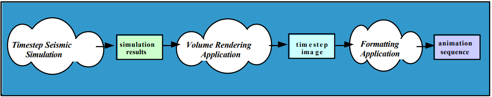

# 08 Prepare: User/Kernel Threads and Computer Architecture

**Things you should know or know how to do that you learned from last week**
(if not, then please ask---see [Matthew 7:7-8](https://www.churchofjesuschrist.org/study/scriptures/nt/matt/7?lang=eng))
1. Explain the challenges of sharing data between processes.
2. Explain what a multiprocessing queue is and how to use to share data between two or more processes.
3. Explain what a multiprocessing pipe is and how to use to share data between two processes.

<ins>Key Concepts in this week's reading:</ins>
1. Basic understanding of user and kernel threads.
2. Understanding of some basic computer components.
3. Recursion: what it is and how to use it.
4. Understanding of various ways to categorize parallel programs.

## User and Kernel Threads

[Wikipedia Threads](https://en.wikipedia.org/wiki/Thread_\(computing\))

(The following section was taken from https://www.tutorialspoint.com/operating_system/os_multi_threading.htm)

A thread is a thread is a thread. However, there are two types of threads.  User and Kernel threads.

A User thread is one that executes user-space code.  It is managed by you the programmer or in the case of Python, by the GIL.

A Kernel thread is one that only runs kernel code and isn't associated with a user-space process.  These threads are controlled by the operating system.  You can not create or delete kernel threads.  Each OS has a "kernel" or core.  Kernel threads do not match the number of CPUs on a computer.  The number of these threads can be high.

Threads in processes/programs.  All threads must run in a process.  The definition of a process is a program that is loaded into memory and is running on an operating system.

In an operating system, there are two spaces.  User and kernel space.  A programmer programs in the user space.  In order for your program to do something interesting such as print() to a screen or open a file, etc., it must make a system call (function call) into the kernel space.  A thread library is used to help with these system calls.  For Python, it is the GIL.

### Relation between user and kernel threads

When you start a program on a computer, the OS will load that program into memory (called a process now), and assign some kernel threads to that process.  Kernel threads are the threads that run on CPUs.  There are a number of different user/kernel relationships that can be followed by the OS

#### Many to Many

The many-to-many model multiplexes any number of user threads onto an equal or smaller number of kernel threads.

The following diagram shows the many-to-many threading model where 6 user level threads are multiplexing with 6 kernel level threads. In this model, developers can create as many user threads as necessary and the corresponding Kernel threads can run in parallel on a multiprocessor machine. This model provides the best accuracy on concurrency and when a thread performs a blocking system call, the kernel can schedule another thread for execution

#### Many to One

Many-to-one model maps many user level threads to one Kernel-level thread. Thread management is done in user space by the thread library. When thread makes a blocking system call, the entire process will be blocked. Only one thread can access the Kernel at a time, so multiple threads are unable to run in parallel on multiprocessors.

If the user-level thread libraries are implemented in the operating system in such a way that the system does not support them, then the Kernel threads use the many-to-one relationship modes.

#### One to One

There is one-to-one relationship of user-level thread to the kernel-level thread. This model provides more concurrency than the many-to-one model. It also allows another thread to run when a thread makes a blocking system call. It supports multiple threads to execute in parallel on microprocessors.

Disadvantage of this model is that creating user thread requires the corresponding Kernel thread. OS/2, windows NT and windows 2000 use one to one relationship model.

## Computer Architecture

### Overview

Here is a quick overview of parts of a computer.  The bus is a high-speed internal connection. Buses are used to send control signals and data between the processor and other components.

### CPU Cache

[Video: What is CPU Cache?](https://www.youtube.com/watch?v=sHqNMHf2UNI)

> A CPU cache is a hardware cache used by the central processing unit (CPU) of a computer to reduce the average cost (time or energy) to access data from the main memory.[1] A cache is a smaller, faster memory, located closer to a processor core, which stores copies of the data from frequently used main memory locations. Most CPUs have a hierarchy of multiple cache levels (L1, L2, often L3, and rarely even L4), with separate instruction-specific and data-specific caches at level 1.

Cache levels.  In CPUs today, all three levels are found on the CPU.

The cache memory connects to the motherboard bus.

In this image, you can see that each core of a CPU has their own L1 and L2 cache.  The larger L3 cache is shared between cores.

#### Intel CPUs

Here are comparisons between the Intel i3, i5, i7 and i9 CPUs.  Notice the differences in cache sizes

## Recursion

We will be using recursion for the next assignment.

> In computer science, recursion is a method of solving a problem where the solution depends on solutions to smaller instances of the same problem. Such problems can generally be solved by iteration, but this needs to identify and index the smaller instances at programming time. Recursion solves such recursive problems by using functions that call themselves from within their own code. The approach can be applied to many types of problems, and recursion is one of the central ideas of computer science.

### Links (yes, you should click on these links)

Review these links if you need to understand recursion more or need to refresh your memory.

- [Recursion (computer science)](https://en.wikipedia.org/wiki/Recursion_\(computer_science\))
- [Recursion in Python](https://realpython.com/python-thinking-recursively/#recursive-functions-in-python)
- [Understanding Recursion](https://stackabuse.com/understanding-recursive-functions-with-python/)
- [Video on Recursion](https://www.youtube.com/watch?v=ngCos392W4w)
- [What on Earth is Recursion? - Computerphile](https://www.youtube.com/watch?v=Mv9NEXX1VHc)

- [Examples of Recursion in Python](https://vegibit.com/python-recursion-examples/) -> Good way to get better at understanding recursion is to write these program examples. 

# Analyzing Programs

The goal of a software developer is to study and analyses algorithms.  For concurrency and parallelism, we are looking to see if it makes sense to take the time to try to make it concurrent or parallel.  Adding parallelism to software involves a learning curve and requires more effort.

## Fine-grained, coarse-grained, and embarrassing parallel

Applications are often classified according to how often their sub tasks need to synchronize or communicate with each other. An application exhibits fine-grained parallelism if its sub tasks must communicate many times per second; it exhibits coarse-grained parallelism if they do not communicate many times per second, and it exhibits embarrassing parallelism if they rarely or never have to communicate. Embarrassingly parallel applications are considered the easiest to add parallelism.

(Parts of the following is from [Parallelism Document](https://web.engr.oregonstate.edu/~pancake/presentations/sdsc.pdf))

## Embarrassingly parallel

The best type of software to make parallel is called [Embarrassingly parallel](https://en.wikipedia.org/wiki/Embarrassingly_parallel).

> Parallel computing, a paradigm in computing which has multiple tasks running simultaneously, might contain what is known as an embarrassingly parallel workload or problem (also called `perfectly parallel`, `delightfully parallel` or `pleasingly parallel`). An embarrassingly parallel task can be considered a trivial case - little or no manipulation is needed to separate the problem into a number of parallel tasks. This is often the case where there is little or no dependency or need for communication between those parallel tasks, or for results between them.

> Thus, these are different from distributed computing problems that need communication between tasks, especially communication of intermediate results. They are easy to perform on server farms which lack the special infrastructure used in a true supercomputer cluster. They are thus well suited to large, Internet-based distributed platforms such as BOINC, and do not suffer from parallel slowdown. The opposite of embarrassingly parallel problems are inherently serial problems, which cannot be parallelized at all.

> A common example of an embarrassingly parallel problem is 3D video rendering handled by a graphics processing unit, where each frame (forward method) or pixel (ray tracing method) can be handled with no interdependency. Some forms of password cracking are another embarrassingly parallel task that is easily distributed on central processing units, CPU cores, or clusters.

Unfortunately, there are not a great deal of embarrassingly parallel problems to find.  There is, of course, the other extreme case where a program can not have any parallelism. (For example, a shopping cart program.  The program can't do anything until the user makes a choice to do something).

One of the goals of this course is to understand that we might be able to add parallelism to programs and if it makes sense and is possible, then we can speed up the software.

Examples:

- 3D image rendering
- Low level image processing
- Genetic programming — In genetic programming, algorithms are "evolved" in groups by combining and mutating previous generations. Each of these individuals are processed independently in parallel.
- Mandelbrot set — A fractal where each point is calculated individually, independent of the others.
- Monte Carlo algorithms — A wide range of computational tasks that are processed by pseudorandom sampling of individual elements.
- DFT (Discrete Fourier Transform) — A widely-used technique for processing equally-spaced samples of a function or signal. Commonly used in DSP (digital signal processing), based on the work of French mathematician Jean Fourier.
- Brute-force cryptographic tasks — A range of cryptographic problems, such as Proof-of-Work algorithms, that perform many similar computations, efficiently executed in parallel.

## Pipeline Parallelism

Some software problems can be expressed in a pipeline where one stage creates data for the next stage, and so on.  Computer graphic cards (GPUs) use the pipeline method.

- Data from different time steps used to generate series of images
- Job can be subdivided into phases which process the output of earlier phases
- Concurrency comes from overlapping the processing for multiple phases
- Key characteristic: only need to pass results one-way
  - Can delay start-up of later phases so input will be ready
- Potential problems
  - Assumes phases are computationally balanced 

## Fully Synchronous Parallelism

- Same operation is applied in parallel to multiple data.
- Examples include weather predictions
- Key characteristic: Each operation is performed on all (or most) data
  - Operations/decisions depend on results of previous operations
- Potential problems
  - Serial bottlenecks force other processors to “wait”

## Loosely Synchronous Parallelism

- Amount of computation varies dramatically in time and space
- Concurrency from letting different processors proceed at their own rates
- Key characteristic
  - Processors each do small pieces of the problem, sharing information only intermittently
- Potential problems
  - Sharing information requires “synchronization” of processors (where one
processor will have to wait for another)

## Rules-of-Thumb Based on Type of Problem

1. If your application fits the model of perfect parallelism
     - the parallelization task is relatively straightforward and likely to achieve respectable performance
2. If your application is an example of pipeline parallelism
     - you have to do more work. If you can’t balance the computational intensity, it may not prove worthwhile
3. If your application is fully synchronous
     - a significant amount of effort is required and payoff may be minimal. The decision to parallelize should be based on how uniform computational intensity is likely to be
4. A loosely synchronous application is the most difficult to parallelize
     - it’s probably not worthwhile unless the points of CPU interaction are very infrequent
