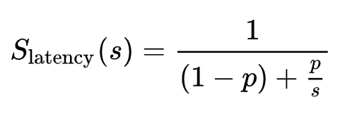
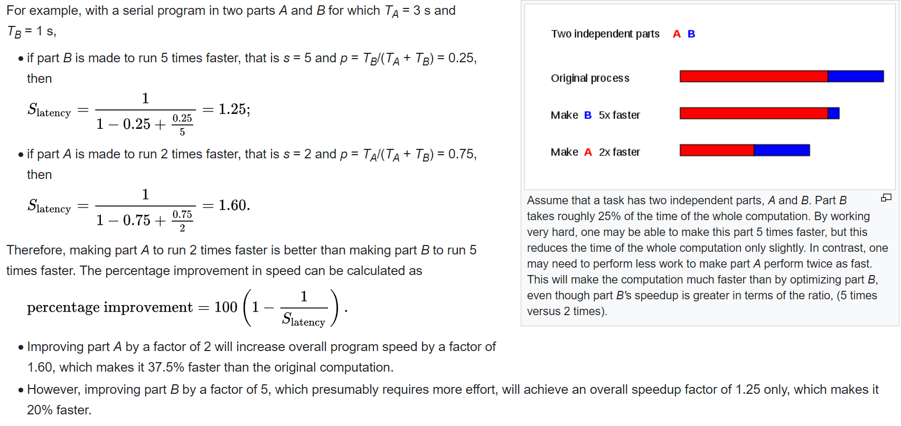

# 09 Prepare: Asynchronous Processes

**Things you should know or know how to do that you learned from last week**
(if not, then please ask---see [Matthew 7:7-8](https://www.churchofjesuschrist.org/study/scriptures/nt/matt/7?lang=eng))
1. Explain what a user and kernel threads are.
2. Explain some basic computer components.
3. Explain in detail what recursion is and can provide a step-by-step explanation of some simple recursive programs (make sure you followed the provide links and spent time writing some recursive programs).
4. Basic familiarity of ways to categorize parallel programs.

<ins>Key Concepts in this week's reading:</ins>
1. Learn the difference between asynchronous and synchronous operations.
2. Learn the difference between parallel and concurrent tasks.
3. How to use apply_async.

## Overview

This week we will learn about asynchronous processing with process pools.  Please read the provided links for details on this topic.

## Preparation Material

### Links to Articles

- [What is asynchronous processing?](https://stackoverflow.com/questions/748175/asynchronous-vs-synchronous-execution-what-does-it-really-mean)
- [Difference between Synchronous and Asynchronous programming](https://www.geekinsta.com/difference-between-synchronous-and-asynchronous-programming/)
- [Python documentation - search for "apply_async"](https://docs.python.org/3/library/multiprocessing.html)

## Asynchronous vs Synchronous Programming

In programming, synchronous operations block instructions until the task is completed, while asynchronous operations can execute without blocking. Asynchronous operations are generally completed by firing an event or by calling a provided callback function.


**Asynchronous != Parallelism**

It's important to understand that an asynchronous thread of execution may or may not be running parallel with other threads. As programmers, we determine if we want to run something asynchronously. We can create threads/processes to try and run tasks in parallel. But, only the operating system controls whether multiple threads/processes will run in parallel or will be placed in a queue and run concurrently. The OS determines which thread/process will run on a cpu/core at a given time and may decide to run a small amount of time one thread/process and then switch to another thread/process (i.e., concurrently).

The advantage of running a thread/process asynchronously is that the flow of execution is not blocked and our program can continue while the asynch thread/process completes.

### Coding examples using Process pools

#### Example 1

In this first example, we are using the `map()` function to map a list to a function.  Note that we need to get all of the data in a list before the call to the `map()` function and that the `map()` call is synchronous meaning that it doesn't return until the function is finished.

We will be using the function `apply_async()` with process pools for this week's assignment. Review the coding example below and the linked articles above in this document.

```python
# Example using a pool map

import multiprocessing as mp 

def sum_all_values(x):
    total = 0
    for i in range(1, x + 1):
        total += i
    return total

if __name__ == "__main__":
    pool = mp.Pool(4)
    results = pool.map(sum_all_values, range(100000, 100000 + 100))
    pool.close()
    pool.join()
    print(results)
```

Output:

```
[5000050000, 5000150001, 5000250003,...., 5009754753, 5009854851, 5009954950]
```

#### Example 2

This second example is using the function `apply_async()`  It is asynchronous meaning that the function will return before the processes are finished processes the data.

```python
# Example using pool apply_asyc()

import multiprocessing as mp 

def sum_all_values(x):
    total = 0
    for i in range(1, x + 1):
        total += i
    return total
    
if __name__ == "__main__":
    pool = mp.Pool(4)
    results = [pool.apply_async(sum_all_values, args=(x,)) for x in range(10000, 10000 + 10)]
    pool.close()
    # do something else

    # collect all of the results into a list
    output = [p.get() for p in results]
    print(output)

```

output:

```
[50005000, 50015001, 50025003, 50035006, 50045010, 50055015, 50065021, 50075028, 50085036, 50095045]
```


Review of the program example above:


the `results` variable is a list of "future" work by the process pool.  This statement is quick to run as once the list is complete, Python will run the next line in your program.  At this point, some of the processes in the pool as been started and is processing the data.

```python
results = [pool.apply_async(sum_all_values, args=(x,)) for x in range(10000, 10000 + 10)]
```

With this next statement, the program is now collecting the results of the process pool.  If the pool is finished processing all of the data, then this statement is quick.  However, if any process in the pool is still doing work, then this statement is synchronous (ie., waits for the pool to finish)

```python
output = [p.get() for p in results]
```

The "get()" function is a blocking function.

#### Example 3

Here is the same program from example 2 processing a larger range of values.


```python
# Example using pool apply_asyc()

import multiprocessing as mp 

def sum_all_values(x):
    total = 0
    for i in range(1, x + 1):
        total += i
    return total
    
if __name__ == "__main__":
    pool = mp.Pool(4)
    results = [pool.apply_async(sum_all_values, args=(x,)) for x in range(100000000, 100000000 + 100)]
    pool.close()
    output = [p.get() for p in results]
    print(output)
```

Output:

```
[5000000050000000, 5000000150000001, 5000000250000003, 5000000350000006, 5000000450000010, 5000000550000015, 5000000650000021, 5000000750000028, 5000000850000036, 5000000950000045, 5000001050000055, 5000001150000066, 5000001250000078, 5000001350000091, 5000001450000105, 5000001550000120, 5000001650000136, 5000001750000153, 5000001850000171, 5000001950000190, 5000002050000210, 5000002150000231, 5000002250000253, 5000002350000276, 5000002450000300, 5000002550000325, 5000002650000351, 5000002750000378, 5000002850000406, 5000002950000435, 5000003050000465, 5000003150000496, 5000003250000528, 5000003350000561, 5000003450000595, 5000003550000630, 5000003650000666, 5000003750000703, 5000003850000741, 5000003950000780, 5000004050000820, 5000004150000861, 5000004250000903, 5000004350000946, 5000004450000990, 5000004550001035, 5000004650001081, 5000004750001128, 5000004850001176, 5000004950001225, 5000005050001275, 5000005150001326, 5000005250001378, 5000005350001431, 5000005450001485, 5000005550001540, 5000005650001596, 5000005750001653, 5000005850001711, 5000005950001770, 5000006050001830, 5000006150001891, 5000006250001953, 5000006350002016, 5000006450002080, 5000006550002145, 5000006650002211, 5000006750002278, 5000006850002346, 5000006950002415, 5000007050002485, 5000007150002556, 5000007250002628, 5000007350002701, 5000007450002775, 5000007550002850, 5000007650002926, 5000007750003003, 5000007850003081, 5000007950003160, 5000008050003240, 5000008150003321, 5000008250003403, 5000008350003486, 5000008450003570, 5000008550003655, 5000008650003741, 5000008750003828, 5000008850003916, 5000008950004005, 5000009050004095, 5000009150004186, 5000009250004278, 5000009350004371, 5000009450004465, 5000009550004560, 5000009650004656, 5000009750004753, 5000009850004851, 5000009950004950] 
```


#### Example 4

In this example, the pool() using the method `apply_async()`.  The way that this works is that instead of having all of the tasks in a list and the results in a list, as each process finishes their job with the data, the callback function is called.  In this callback function, you can collect the results - one at a time for the process pool.

When we have processes, global variables can't be used because they each have their own version of the GIL.  When using the callback function feature, that callback function is running in the main thread of the program where it can use any global variables of the program.  This means that there is no issue with shared data between processes.

In order to know when the pool is finished, you need to have the statements `pool.close()` and `pool.join()`.

```python
# Example using pool apply_asyc() and callback function

import multiprocessing as mp
import time

result_list = []

def sum_all_values(x):
    total = 0
    for i in range(1, x + 1):
        total += i
    return total

def log_result(result):
    # This is called whenever sum_all_values(i) returns a result.
    # result_list is modified only by the main process, not the pool workers.
    result_list.append(result)

def apply_async_with_callback():
    pool = mp.Pool(4)

    print('Before For loop')
    for i in range(100000, 100000 + 100):
        pool.apply_async(sum_all_values, args = (i, ), callback = log_result)
    print('After For loop')

    # Do something while the processes are doing their work

    # Need to know when the pool is finished
    pool.close()
    pool.join()

    print('Finished')

    # display the global variable of the results from the pool
    print(result_list)

if __name__ == '__main__':
    apply_async_with_callback()
```

Output:

Notice that the `for` loop was quick to get the data to the process pool.

```
Before For loop
After For loop
Finished
[500500, 501501, 502503, 503506, 504510, 505515, 506521, 507528, 508536, 509545, 510555, 511566, 512578, 513591, 514605, 515620, 516636, 517653, 518671, 519690, 520710, 521731, 522753, 523776, 524800, 525825, 526851, 527878, 528906, 529935, 530965, 531996, 533028, 534061, 535095, 536130, 537166, 538203, 539241, 540280, 541320, 542361, 543403, 544446, 545490, 546535, 547581, 548628, 549676, 550725, 551775, 552826, 553878, 554931, 555985, 557040, 558096, 559153, 560211, 561270, 562330, 563391, 564453, 565516, 566580, 567645, 568711, 569778, 570846, 571915, 572985, 574056, 575128, 576201, 577275, 578350, 579426, 580503, 581581, 582660, 583740, 584821, 585903, 586986, 588070, 589155, 590241, 591328, 592416, 593505, 594595, 595686, 596778, 597871, 598965, 600060, 601156, 602253, 603351, 604450]
```

#### Example 5

Once a process pool is created, you are free to add jobs to the pool any time in your program as long as it's before calling `pool.close()` and `pool.join()`.  Here is an example where the program adds a job to the pool after sleeping a little while.

The advantage of using a call back function with the process pool is that the program doesn't need to have all of the data collected in order for the pool to start doing something.

```python
# Example using pool apply_asyc() and callback function

import multiprocessing as mp
import time

result_list = []

def sum_all_values(x):
    total = 0
    for i in range(1, x + 1):
        total += i
    return total

def log_result(result):
    # This is called whenever sum_all_values(i) returns a result.
    # result_list is modified only by the main process, not the pool workers.
    result_list.append(result)

def apply_async_with_callback():
    pool = mp.Pool(4)

    # Add job to the pool
    pool.apply_async(sum_all_values, args = (10000, ), callback = log_result)
    
    time.sleep(1)       # Do something - this is the main thread sleeping

    pool.apply_async(sum_all_values, args = (10001, ), callback = log_result)

    time.sleep(1)       # Do something

    pool.apply_async(sum_all_values, args = (10002, ), callback = log_result)

    time.sleep(1)       # Do something

    pool.apply_async(sum_all_values, args = (10003, ), callback = log_result)

    # Do something while the processes are doing their work

    # Need to know when the pool is finished
    pool.close()
    pool.join()

    print('Finished')

    # display the global variable of the results from the pool
    print(result_list)

if __name__ == '__main__':
    apply_async_with_callback()
```

Output:

```
Finished
[50005000, 50015001, 50025003, 50035006]
```

## Amdahl's Law

(The following section comes from Wikipedia)

When adding processes to a software problem, there is a "limit" or point where adding more processes to a problem doesn't speed it up very much or at all.  Amdahl's Law is used to understand this.

[Wikipedia Amdahl's law page](https://en.wikipedia.org/wiki/Amdahl%27s_law)

### Amdahl's Law Formula



**where**

- S<sub>latency</sub> is the theoretical speedup of the execution of the whole task.
- s is the speedup of the part of the task that benefits from improved system resources.
- p is the proportion of execution time that the part benefiting from improved resources originally occupied.

### Example 1

Amdahl's law is often used in parallel computing to predict the theoretical speedup when using multiple processors. For example, if a program needs 20 hours to complete using a single thread, but a one-hour portion of the program cannot be parallelized, therefore only the remaining 19 hours (p = 0.95) of execution time can be parallelized, then regardless of how many threads are devoted to a parallelized execution of this program, the minimum execution time cannot be less than one hour. Hence, the theoretical speedup is limited to at most 20 times the single thread performance,


The theoretical speedup of the latency of the execution of a program as a function of the number of processors executing it, according to Amdahl's law. The speedup is limited by the serial part of the program. For example, if 95% of the program can be parallelized, the theoretical maximum speedup using parallel computing would be 20 times.

### Example 2




### Relation to the law of diminishing returns

Amdahl's law is often conflated with the [law of diminishing returns](https://en.wikipedia.org/wiki/Diminishing_returns), whereas only a special case of applying Amdahl's law demonstrates law of diminishing returns. If one picks optimally (in terms of the achieved speedup) what to improve, then one will see monotonically decreasing improvements as one improves. If, however, one picks non-optimally, after improving a sub-optimal component and moving on to improve a more optimal component, one can see an increase in the return. Note that it is often rational to improve a system in an order that is "non-optimal" in this sense, given that some improvements are more difficult or require larger development time than others.

Amdahl's law does represent the law of diminishing returns if on considering what sort of return one gets by adding more processors to a machine, if one is running a fixed-size computation that will use all available processors to their capacity. Each new processor added to the system will add less usable power than the previous one. Each time one doubles the number of processors the speedup ratio will diminish, as the total throughput heads toward the limit of 1/(1 − p).

This analysis neglects other potential bottlenecks such as memory bandwidth and I/O bandwidth. If these resources do not scale with the number of processors, then merely adding processors provides even lower returns.
